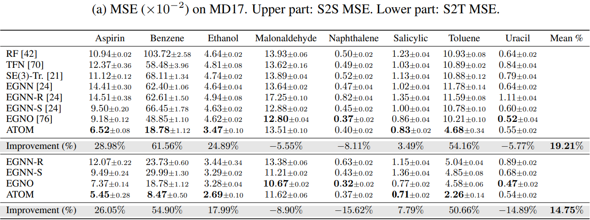
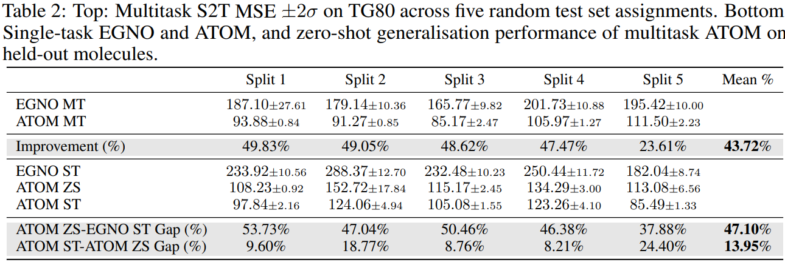

# ATOM: A Pretrained Neural Operator for Multitask Dynamics Learning

This repository is the official implementation of [ATOM: A Pretrained Neural Operator for Multitask Dynamics Learning](https://arxiv.org/abs/2030.12345). ATOM is a graph transformer neural operator for the parallel decoding of molecular dynamics trajectory. We show state-of-the-art performance on the existing MD17 dataset, and for the first time, demonstrate zero-shot generalization to unseen chemical compounds.


## Requirements

To install requirements:

```setup
poetry install --with dev
```

The results were gathered on Cuda 12.4.

## Training

To train ATOM, run this command:

```bash
poetry run train --config <<path_to_config.toml>>
```

to train multiple models (e.g., for the purpose of ablations) run:

```bash
poetry run train --configs <<path_to_folder_containing_configs>>
```

To edit model hyperparameters, please edit the config.toml files. Feel free to experiment! A Pydantic validator will ensure your hyperparameter choices do not cause unforeseen issues :).

## Evaluation

To inference ATOM run the command:
```bash
poetry run train --model <<path_to_model.pth>> --config <<path_to_config.toml>>
```

For example, to evaluate the performance when Δt = 3000, run:

```bash
poetry run inference --model benchmark_runs/t_invariance/delta_t_3000_aspirin_13-Apr-2025_01-46-23/run_3/best_val_model.pth --config configs/t_invariance/3000.toml
```

To test equivariance run:
```bash
python tests/test_equivariance.py --config configs/md17_paper/md_aspirin.toml --model benchmark_runs/paper_md17_singletask_12-May-2025_23-33-44/run_1/best_val_model.pth
```

## Performing Single Task Learning Experiments on TG80

<details>

<summary>Commands to generate zero-shot results for ATOM</summary>

### Uracil (Fold 1)
```bash
poetry run inference --runs \
  "benchmark_runs/tg80_atom_st/atom_tg80_uracil_fromFold1_st/run_1/best_val_model.pth,configs/tg80_st_atom/atom_singletask_uracil_fold1st.toml" \
  "benchmark_runs/tg80_atom_st/atom_tg80_uracil_fromFold1_st/run_2/best_val_model.pth,configs/tg80_st_atom/atom_singletask_uracil_fold1st.toml" \
  "benchmark_runs/tg80_atom_st/atom_tg80_uracil_fromFold1_st/run_3/best_val_model.pth,configs/tg80_st_atom/atom_singletask_uracil_fold1st.toml"
```

### Nitrobenzene (Fold 2)
```bash
poetry run inference --runs \
  "benchmark_runs/tg80_atom_st/atom_th80_nitrobenzene_fromFold2_st/run_1/best_val_model.pth,configs/tg80_st_atom/atom_singletask_nitrobenzene_fold2st.toml" \
  "benchmark_runs/tg80_atom_st/atom_th80_nitrobenzene_fromFold2_st/run_2/best_val_model.pth,configs/tg80_st_atom/atom_singletask_nitrobenzene_fold2st.toml" \
  "benchmark_runs/tg80_atom_st/atom_th80_nitrobenzene_fromFold2_st/run_3/best_val_model.pth,configs/tg80_st_atom/atom_singletask_nitrobenzene_fold2st.toml"
```

### Indole (Fold 3)
```bash
poetry run inference --runs \
  "benchmark_runs/tg80_atom_st/atom_tg80_indole_fromFold3_st/run_1/best_val_model.pth,configs/tg80_st_atom/egno_singletask_indole_fold3st.toml" \
  "benchmark_runs/tg80_atom_st/atom_tg80_indole_fromFold3_st/run_2/best_val_model.pth,configs/tg80_st_atom/egno_singletask_indole_fold3st.toml" \
  "benchmark_runs/tg80_atom_st/atom_tg80_indole_fromFold3_st/run_3/best_val_model.pth,configs/tg80_st_atom/egno_singletask_indole_fold3st.toml"
```

### Naphthalene (Fold 4)
```bash
poetry run inference --runs \
  "benchmark_runs/tg80_atom_st/atom_tg80_naphthalene_fromFold4_st/run_1/best_val_model.pth,configs/tg80_st_atom/atom_singletask_naphthalene_fold4st.toml" \
  "benchmark_runs/tg80_atom_st/atom_tg80_naphthalene_fromFold4_st/run_2/best_val_model.pth,configs/tg80_st_atom/atom_singletask_naphthalene_fold4st.toml" \
  "benchmark_runs/tg80_atom_st/atom_tg80_naphthalene_fromFold4_st/run_3/best_val_model.pth,configs/tg80_st_atom/atom_singletask_naphthalene_fold4st.toml"
```

### Butanol (Fold 5)
```bash
poetry run inference --runs \
  "benchmark_runs/tg80_atom_st/atom_tg80_butanol_fromFold5_st/run_1/best_val_model.pth,configs/tg80_st_atom/atom_singletask_butanol_fold5st.toml" \
  "benchmark_runs/tg80_atom_st/atom_tg80_butanol_fromFold5_st/run_2/best_val_model.pth,configs/tg80_st_atom/atom_singletask_butanol_fold5st.toml" \
  "benchmark_runs/tg80_atom_st/atom_tg80_butanol_fromFold5_st/run_3/best_val_model.pth,configs/tg80_st_atom/atom_singletask_butanol_fold5st.toml"
```

</details>

<details>

<summary>Commands to generate single task results for EGNO</summary>

### Uracil (Fold 1)
```bash
poetry run inference --runs \
  "benchmark_runs/tg80_egno_st/egno_tg80_nitrobenzene_fromFold2_st/run_1/best_val_model.pth,configs/tg80_st_egno/egno_singletask_uracil_fold1st.toml" \
  "benchmark_runs/tg80_egno_st/egno_tg80_nitrobenzene_fromFold2_st/run_2/best_val_model.pth,configs/tg80_st_egno/egno_singletask_uracil_fold1st.toml" \
  "benchmark_runs/tg80_egno_st/egno_tg80_nitrobenzene_fromFold2_st/run_3/best_val_model.pth,configs/tg80_st_egno/egno_singletask_uracil_fold1st.toml"
```

### Nitrobenzene (Fold 2)
```bash
poetry run inference --runs \
  "benchmark_runs/tg80_egno_st/egno_tg80_nitrobenzene_fromFold2_st/run_1/best_val_model.pth,configs/tg80_st_egno/egno_singletask_nitrobenzene_fold2st.toml" \
  "benchmark_runs/tg80_egno_st/egno_tg80_nitrobenzene_fromFold2_st/run_2/best_val_model.pth,configs/tg80_st_egno/egno_singletask_nitrobenzene_fold2st.toml" \
  "benchmark_runs/tg80_egno_st/egno_tg80_nitrobenzene_fromFold2_st/run_3/best_val_model.pth,configs/tg80_st_egno/egno_singletask_nitrobenzene_fold2st.toml"
```

### Indole (Fold 3)
```bash
poetry run inference --runs \
  "benchmark_runs/tg80_egno_st/egno_tg80_indole_fromFold3_st/run_1/best_val_model.pth,configs/tg80_st_egno/egno_singletask_indole_fold3st.toml" \
  "benchmark_runs/tg80_egno_st/egno_tg80_indole_fromFold3_st/run_2/best_val_model.pth,configs/tg80_st_egno/egno_singletask_indole_fold3st.toml" \
  "benchmark_runs/tg80_egno_st/egno_tg80_indole_fromFold3_st/run_3/best_val_model.pth,configs/tg80_st_egno/egno_singletask_indole_fold3st.toml"
```

### Naphthalene (Fold 4)
```bash
poetry run inference --runs \
  "benchmark_runs/tg80_egno_st/egno_tg80_naphtalene_fromFold4_st/run_1/best_val_model.pth,configs/tg80_st_egno/egno_singletask_napthalene_fold4st.toml" \
  "benchmark_runs/tg80_egno_st/egno_tg80_naphtalene_fromFold4_st/run_2/best_val_model.pth,configs/tg80_st_egno/egno_singletask_napthalene_fold4st.toml" \
  "benchmark_runs/tg80_egno_st/egno_tg80_naphtalene_fromFold4_st/run_3/best_val_model.pth,configs/tg80_st_egno/egno_singletask_napthalene_fold4st.toml"
```

### Butanol (Fold 5)
```bash
poetry run inference --runs \
  "benchmark_runs/tg80_egno_st/egno_tg80_butanol_fromFold5_st/run_1/best_val_model.pth,configs/tg80_st_egno/egno_singletask_butanol_fold5st.toml" \
  "benchmark_runs/tg80_egno_st/egno_tg80_butanol_fromFold5_st/run_2/best_val_model.pth,configs/tg80_st_egno/egno_singletask_butanol_fold5st.toml" \
  "benchmark_runs/tg80_egno_st/egno_tg80_butanol_fromFold5_st/run_3/best_val_model.pth,configs/tg80_st_egno/egno_singletask_butanol_fold5st.toml"
```

</details>

## Performing Zero-shot Generalization Generalization Experiments on TG80

<details>

<summary>Commands to generate zero-shot results for ATOM</summary>

### Uracil (Fold 1)
```bash
poetry run inference --runs \
  "benchmark_runs/tg80_atom_mt/atom_tg80_multitask_muon_fold1_multitask_15-May-2025_09-36-35/run_1/best_val_model.pth,configs/tg80_multitask_zs_atom/atom_zs_fold1.toml" \
  "benchmark_runs/tg80_atom_mt/atom_tg80_multitask_muon_fold1_multitask_15-May-2025_12-39-07/run_1/best_val_model.pth,configs/tg80_multitask_zs_atom/atom_zs_fold1.toml" \
  "benchmark_runs/tg80_atom_mt/atom_tg80_multitask_muon_fold1_multitask_15-May-2025_12-39-07/run_2/best_val_model.pth,configs/tg80_multitask_zs_atom/atom_zs_fold1.toml"
```

### Nitrobenzene (Fold 2)
```bash
poetry run inference --runs \
  "benchmark_runs/tg80_atom_mt/atom_tg80_multitask_muon_fold2_multitask_15-May-2025_10-31-21/run_1/best_val_model.pth,configs/tg80_multitask_zs_atom/atom_zs_fold2.toml" \
  "benchmark_runs/tg80_atom_mt/atom_tg80_multitask_muon_fold2_multitask_15-May-2025_13-18-52/run_1/best_val_model.pth,configs/tg80_multitask_zs_atom/atom_zs_fold2.toml" \
  "benchmark_runs/tg80_atom_mt/atom_tg80_multitask_muon_fold2_multitask_15-May-2025_13-18-52/run_2/best_val_model.pth,configs/tg80_multitask_zs_atom/atom_zs_fold2.toml"
```

### Indole (Fold 3)
```bash
poetry run inference --runs \
  "benchmark_runs/tg80_atom_mt/atom_tg80_multitask_muon_fold3_multitask_15-May-2025_11-20-46/run_1/best_val_model.pth,configs/tg80_multitask_zs_atom/atom_zs_fold3.toml" \
  "benchmark_runs/tg80_atom_mt/atom_tg80_multitask_muon_fold3_multitask_15-May-2025_14-10-00/run_1/best_val_model.pth,configs/tg80_multitask_zs_atom/atom_zs_fold3.toml" \
  "benchmark_runs/tg80_atom_mt/atom_tg80_multitask_muon_fold3_multitask_15-May-2025_14-10-00/run_2/best_val_model.pth,configs/tg80_multitask_zs_atom/atom_zs_fold3.toml"
```

### Napthalene (Fold 4)
```bash
poetry run inference --runs \
  "benchmark_runs/tg80_atom_mt/atom_tg80_multitask_muon_fold4_multitask_15-May-2025_12-08-25/run_1/best_val_model.pth,configs/tg80_multitask_zs_atom/atom_zs_fold4.toml" \
  "benchmark_runs/tg80_atom_mt/atom_tg80_multitask_muon_fold4_multitask_15-May-2025_12-39-39/run_1/best_val_model.pth,configs/tg80_multitask_zs_atom/atom_zs_fold4.toml" \
  "benchmark_runs/tg80_atom_mt/atom_tg80_multitask_muon_fold4_multitask_15-May-2025_12-39-39/run_2/best_val_model.pth,configs/tg80_multitask_zs_atom/atom_zs_fold4.toml"
```

### Butanol (Fold 5)
```bash
# Only 2 runs available
poetry run inference --runs \
  "benchmark_runs/tg80_atom_mt/atom_tg80_multitask_muon_fold5_multitask_15-May-2025_12-40-10/run_1/best_val_model.pth,configs/tg80_multitask_zs_atom/atom_zs_fold5.toml" \
  "benchmark_runs/tg80_atom_mt/atom_tg80_multitask_muon_fold5_multitask_15-May-2025_12-40-10/run_2/best_val_model.pth,configs/tg80_multitask_zs_atom/atom_zs_fold5.toml"

# poetry run inference --model benchmark_runs/tg80_atom_mt/atom_tg80_multitask_muon_fold5_multitask_15-May-2025_12-40-10/run_2/best_val_model.pth --config configs/tg80_multitask_zs_atom/atom_zs_fold5.toml
```
You may wish to confirm that none of these pretrained multitask models were trained on the molecules for which we inference them by inspecting their config files.

</details>

<details>

<summary>Commands to generate zero-shot results for EGNO</summary>

### Uracil (Fold 1)
```bash
# Only 2 runs available
poetry run inference --runs \
  "benchmark_runs/tg80_egno_mt/egno_tg80_multitask_muon_fold1_multitask_15-May-2025_08-30-39/run_1/best_val_model.pth,configs/tg80_multitask_zs_egno/egno_zs_fold1.toml" \
  "benchmark_runs/tg80_egno_mt/egno_tg80_multitask_muon_fold1_multitask_15-May-2025_08-32-43/run_1/best_val_model.pth,configs/tg80_multitask_zs_egno/egno_zs_fold1.toml"

# poetry run inference --model benchmark_runs/tg80_atom_mt/atom_tg80_multitask_muon_fold1_multitask_15-May-2025_12-39-07/run_2/best_val_model.pth --config configs/tg80_multitask_zs_egno/egno_zs_fold1.toml
```

### Nitrobenzene (Fold 2)
```bash
# Only 2 runs available
poetry run inference --runs \
  "benchmark_runs/tg80_egno_mt/egno_tg80_multitask_muon_fold2_multitask_15-May-2025_16-29-38/run_1/best_val_model.pth,configs/tg80_multitask_zs_egno/egno_zs_fold2.toml" \
  "benchmark_runs/tg80_egno_mt/egno_tg80_multitask_muon_fold2_multitask_15-May-2025_21-02-57/run_1/best_val_model.pth,configs/tg80_multitask_zs_egno/egno_zs_fold2.toml"

# poetry run inference --model benchmark_runs/tg80_atom_mt/atom_tg80_multitask_muon_fold2_multitask_15-May-2025_13-18-52/run_2/best_val_model.pth --config configs/tg80_multitask_zs_egno/egno_zs_fold2.toml
```

### Indole (Fold 3)
```bash
# Only 2 runs available
poetry run inference --runs \
  "benchmark_runs/tg80_egno_mt/egno_tg80_multitask_muon_fold3_multitask_15-May-2025_16-30-50/run_1/best_val_model.pth,configs/tg80_multitask_zs_egno/egno_zs_fold3.toml" \
  "benchmark_runs/tg80_egno_mt/egno_tg80_multitask_muon_fold3_multitask_15-May-2025_18-53-20/run_1/best_val_model.pth,configs/tg80_multitask_zs_egno/egno_zs_fold3.toml"

# poetry run inference --model benchmark_runs/tg80_atom_mt/atom_tg80_multitask_muon_fold3_multitask_15-May-2025_14-10-00/run_2/best_val_model.pth --config configs/tg80_multitask_zs_egno/egno_zs_fold3.toml
```

### Napthalene (Fold 4)
```bash
# Only 2 runs available
poetry run inference --runs \
  "benchmark_runs/tg80_egno_mt/egno_tg80_multitask_muon_fold4_multitask_15-May-2025_16-30-54/run_1/best_val_model.pth,configs/tg80_multitask_zs_egno/egno_zs_fold4.toml" \
  "benchmark_runs/tg80_egno_mt/egno_tg80_multitask_muon_fold4_multitask_15-May-2025_18-53-19/run_1/best_val_model.pth,configs/tg80_multitask_zs_egno/egno_zs_fold4.toml"

# poetry run inference --model benchmark_runs/tg80_atom_mt/atom_tg80_multitask_muon_fold4_multitask_15-May-2025_12-39-39/run_2/best_val_model.pth --config configs/tg80_multitask_zs_egno/egno_zs_fold4.toml
```

### Butanol (Fold 5)
```bash
# Only 2 runs available
poetry run inference --runs \
  "benchmark_runs/tg80_egno_mt/egno_tg80_multitask_muon_fold5_multitask_15-May-2025_16-51-18/run_1/best_val_model.pth,configs/tg80_multitask_zs_egno/egno_zs_fold5.toml" \
  "benchmark_runs/tg80_egno_mt/egno_tg80_multitask_muon_fold5_multitask_15-May-2025_19-14-24/run_1/best_val_model.pth,configs/tg80_multitask_zs_egno/egno_zs_fold5.toml"

# poetry run inference --model benchmark_runs/tg80_atom_mt/atom_tg80_multitask_muon_fold5_multitask_15-May-2025_12-40-10/run_2/best_val_model.pth --config configs/tg80_multitask_zs_egno/egno_zs_fold5.toml
```

</details>

## Pre-trained Models

You can download pretrained models here:

- [Anonymized for review]()

## TG80 Dataset

- [Anonymized for review]()

## Results

Our model achieves the following performance:

### [Single-task Trajectory Prediction on MD17](https://www.sgdml.org/)


### [Multitask Trajectory Position Prediction on TG80]()



## Further notes
The notation in the paper generally corresponds to our comments, with the following caveats:
* Timesteps - P -> T

## Contributing
Both ATOM and TG80 are under the MIT licence.

