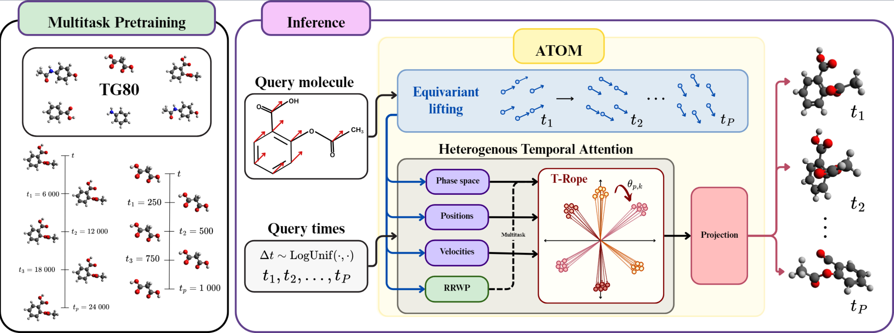

# ATOM: A Pretrained Neural Operator for Multitask Dynamics Learning

This repository contains the official implementation of **ATOM: A Pretrained Neural Operator for Multitask Dynamics Learning**. ATOM is a graph transformer neural operator for molecular dynamics trajectory prediction. It achieves state-of-the-art performance on MD17 and demonstrates zero-shot generalization to unseen chemical compounds in a multitask setting.



## Overview

This repository includes:

- training and inference code for ATOM,
- pretrained checkpoints,
- scripts for reproducing paper tables and figures,
- evaluation utilities for equivariance analysis.

## Installation

We recommend using `uv` for environment management.

```bash
uv sync
```

## Quick start

### Train a single model

```bash
uv run train --config path/to/config.toml
```

### Train multiple models

```bash
uv run train --configs path/to/folder_with_configs
```

### Run inference

```bash
uv run inference --model path/to/model.pth --config path/to/config.toml
```

## Pretrained models

Pretrained checkpoints are available in [`benchmark_runs/`](https://github.com/luke-a-thompson/ATOM/tree/main/benchmark_runs).

## Datasets

### TG80

Our multitask molecular dynamics benchmark dataset of 80 compounds, **TG80**, is available at:

https://ses.library.usyd.edu.au/handle/2123/35120

## Results

### Single-task trajectory prediction on MD17


### Multitask trajectory position prediction on TG80


## Reproducing paper artifacts

The commands below are primarily intended for reproducing the results reported in the paper.

<details>
<summary><strong>Tables and analysis</strong></summary>

### Generate MSE tables

LaTeX tables are written under `Z_paper_content/tables`.

```bash
uv run paper tables mse path/to/egno_runs path/to/atom_runs
```

### Generate runtime tables

```bash
uv run paper tables runtime path/to/egno_runs path/to/atom_runs --dataset <dataset_name>
```

### Generate all tables

```bash
uv run paper tables all path/to/run_dir_1 path/to/run_dir_2
```

### Analyze multitask folds

Prints per-fold statistics and percentage improvements.

```bash
uv run paper analyze folds path/to/egno_multitask_runs path/to/atom_multitask_runs
```

### Analyze raw trajectory datasets

Useful for drift-versus-internal-motion analysis.

```bash
uv run paper analyze dataset data/md17_npz --dataset md17
uv run paper analyze dataset data/rmd17_npz --dataset rmd17
uv run paper analyze dataset data/tg80_npz --dataset tg80
```

### Benchmark inference timing

Writes a JSON summary under `Z_paper_content/` by default.

```bash
uv run paper analyze timing --atom-run-dir path/to/md17_atom_runs --num-repeats 3
```

</details>

<details>
<summary><strong>Figures</strong></summary>

### Ablation bar plots

Saved under `Z_paper_content/ablations`.

```bash
uv run paper figures ablations path/to/ablations_runs
```

### P-invariance curves

Saved under `Z_paper_content/invariance_results` by default.

```bash
uv run paper figures invariance-p --p "[4,8,12]" --config path/to/config.toml --model path/to/checkpoints_dir --save-dir Z_paper_content/invariance_results
```

### T-invariance curves

Saved under `Z_paper_content/invariance_results` by default.

```bash
uv run paper figures invariance-t --t "[1,2,4,8]" --config path/to/config.toml --model path/to/checkpoints_dir --save-dir Z_paper_content/invariance_results
```

### Multitask scaling figures

```bash
uv run paper figures multitask-scaling path/to/tg80_multitask_scaling_runs --output Z_paper_content/multitask_scaling/multitask_scaling.pdf
```

### Trajectory visualizations

```bash
uv run paper figures trajectories data/tg80_npz --dataset tg80
```

</details>

## Equivariance evaluation

<details>
<summary><strong>Loss robustness to input rotations</strong></summary>

### ATOM

```bash
uv run rotation_loss_robustness --config benchmark_runs/md17/md17_uniform_paper_atom_25-Sep-2025_03-36-08/md_aspirin_25-Sep-2025_03-36-08/md_aspirin_25-Sep-2025_03-36-08.toml --model benchmark_runs/md17/md17_uniform_paper_atom_25-Sep-2025_03-36-08/md_aspirin_25-Sep-2025_03-36-08/run_1/best_val_model.pth --num_rotations 20 --rotation_seed 42
```

### ATOM without equivariant lift

```bash
uv run rotation_loss_robustness --config benchmark_runs/ablations_atom_17-Sep-2025_00-38-16/no_equivariant_lifting_17-Sep-2025_00-38-16/no_equivariant_lifting_17-Sep-2025_00-38-16.toml --model benchmark_runs/ablations_atom_17-Sep-2025_00-38-16/no_equivariant_lifting_17-Sep-2025_00-38-16/run_1/best_val_model.pth --num_rotations 20 --rotation_seed 42
```

</details>

<details>
<summary><strong>Monte Carlo quasi-equivariance error</strong></summary>

### ATOM

```bash
uv run equivariance_defect --config benchmark_runs/md17/md17_uniform_paper_atom_25-Sep-2025_03-36-08/md_aspirin_25-Sep-2025_03-36-08/md_aspirin_25-Sep-2025_03-36-08.toml --model benchmark_runs/md17/md17_uniform_paper_atom_25-Sep-2025_03-36-08/md_aspirin_25-Sep-2025_03-36-08/run_1/best_val_model.pth --num_rotations 20 --rotation_seed 42
```

```bash
uv run equivariance_defect --config benchmark_runs/md17/md17_uniform_paper_atom_25-Sep-2025_03-36-08/md_ethanol_25-Sep-2025_03-36-08/md_ethanol_25-Sep-2025_03-36-08.toml --model benchmark_runs/md17/md17_uniform_paper_atom_25-Sep-2025_03-36-08/md_ethanol_25-Sep-2025_03-36-08/run_1/best_val_model.pth --num_rotations 20 --rotation_seed 42
```

```bash
uv run equivariance_defect --config benchmark_runs/md17/md17_uniform_paper_atom_25-Sep-2025_03-36-08/md_malonaldehyde_25-Sep-2025_03-36-08/md_malonaldehyde_25-Sep-2025_03-36-08.toml --model benchmark_runs/md17/md17_uniform_paper_atom_25-Sep-2025_03-36-08/md_malonaldehyde_25-Sep-2025_03-36-08/run_1/best_val_model.pth --num_rotations 20 --rotation_seed 42
```

```bash
uv run equivariance_defect --config benchmark_runs/md17/md17_uniform_paper_atom_25-Sep-2025_03-36-08/md_naphtalene_25-Sep-2025_03-36-08/md_naphtalene_25-Sep-2025_03-36-08.toml --model benchmark_runs/md17/md17_uniform_paper_atom_25-Sep-2025_03-36-08/md_naphtalene_25-Sep-2025_03-36-08/run_1/best_val_model.pth --num_rotations 20 --rotation_seed 42
```

```bash
uv run equivariance_defect --config benchmark_runs/md17/md17_uniform_paper_atom_25-Sep-2025_03-36-08/md_salicylic_25-Sep-2025_03-36-08/md_salicylic_25-Sep-2025_03-36-08.toml --model benchmark_runs/md17/md17_uniform_paper_atom_25-Sep-2025_03-36-08/md_salicylic_25-Sep-2025_03-36-08/run_1/best_val_model.pth --num_rotations 20 --rotation_seed 42
```

```bash
uv run equivariance_defect --config benchmark_runs/md17/md17_uniform_paper_atom_25-Sep-2025_03-36-08/md_toluene_25-Sep-2025_03-36-08/md_toluene_25-Sep-2025_03-36-08.toml --model benchmark_runs/md17/md17_uniform_paper_atom_25-Sep-2025_03-36-08/md_toluene_25-Sep-2025_03-36-08/run_1/best_val_model.pth --num_rotations 20 --rotation_seed 42
```

```bash
uv run equivariance_defect --config benchmark_runs/md17/md17_uniform_paper_atom_25-Sep-2025_03-36-08/md_uracil_25-Sep-2025_03-36-08/md_uracil_25-Sep-2025_03-36-08.toml --model benchmark_runs/md17/md17_uniform_paper_atom_25-Sep-2025_03-36-08/md_uracil_25-Sep-2025_03-36-08/run_1/best_val_model.pth --num_rotations 20 --rotation_seed 42
```

### ATOM without equivariant lift

```bash
uv run equivariance_defect --config benchmark_runs/md17_uniform_paper_atom_non_equivariant_19-Nov-2025_22-49-24/md_aspirin_19-Nov-2025_22-49-24/md_aspirin_19-Nov-2025_22-49-24.toml --model benchmark_runs/md17_uniform_paper_atom_non_equivariant_19-Nov-2025_22-49-24/md_ethanol_19-Nov-2025_22-49-24/run_1/best_val_model.pth --num_rotations 20 --rotation_seed 42
```

```bash
uv run equivariance_defect --config benchmark_runs/md17_uniform_paper_atom_non_equivariant_19-Nov-2025_22-49-24/md_ethanol_19-Nov-2025_22-49-24/md_ethanol_19-Nov-2025_22-49-24.toml --model benchmark_runs/ablations_atom_17-Sep-2025_00-38-16/no_equivariant_lifting_17-Sep-2025_00-38-16/run_1/best_val_model.pth --num_rotations 20 --rotation_seed 42
```

```bash
uv run equivariance_defect --config benchmark_runs/md17_uniform_paper_atom_non_equivariant_19-Nov-2025_22-49-24/md_malonaldehyde_19-Nov-2025_22-49-24/md_malonaldehyde_19-Nov-2025_22-49-24.toml --model benchmark_runs/md17_uniform_paper_atom_non_equivariant_19-Nov-2025_22-49-24/md_malonaldehyde_19-Nov-2025_22-49-24/run_1/best_val_model.pth --num_rotations 20 --rotation_seed 42
```

```bash
uv run equivariance_defect --config benchmark_runs/md17_uniform_paper_atom_non_equivariant_19-Nov-2025_22-49-24/md_naphtalene_19-Nov-2025_22-49-24/md_naphtalene_19-Nov-2025_22-49-24.toml --model benchmark_runs/md17_uniform_paper_atom_non_equivariant_19-Nov-2025_22-49-24/md_naphtalene_19-Nov-2025_22-49-24/run_1/best_val_model.pth --num_rotations 20 --rotation_seed 42
```

```bash
uv run equivariance_defect --config benchmark_runs/md17_uniform_paper_atom_non_equivariant_19-Nov-2025_22-49-24/md_salicylic_19-Nov-2025_22-49-24/md_salicylic_19-Nov-2025_22-49-24.toml --model benchmark_runs/md17_uniform_paper_atom_non_equivariant_19-Nov-2025_22-49-24/md_salicylic_19-Nov-2025_22-49-24/run_1/best_val_model.pth --num_rotations 20 --rotation_seed 42
```

```bash
uv run equivariance_defect --config benchmark_runs/md17_uniform_paper_atom_non_equivariant_19-Nov-2025_22-49-24/md_toluene_19-Nov-2025_22-49-24/md_toluene_19-Nov-2025_22-49-24.toml --model benchmark_runs/md17_uniform_paper_atom_non_equivariant_19-Nov-2025_22-49-24/md_toluene_19-Nov-2025_22-49-24/run_1/best_val_model.pth --num_rotations 20 --rotation_seed 42
```

```bash
uv run equivariance_defect --config benchmark_runs/md17_uniform_paper_atom_non_equivariant_19-Nov-2025_22-49-24/md_uracil_19-Nov-2025_22-49-24/md_uracil_19-Nov-2025_22-49-24.toml --model benchmark_runs/md17_uniform_paper_atom_non_equivariant_19-Nov-2025_22-49-24/md_uracil_19-Nov-2025_22-49-24/run_1/best_val_model.pth --num_rotations 20 --rotation_seed 42
```

</details>

## Notes

The notation in the paper generally matches the codebase, with one main exception:

- `P` in the paper corresponds to `T` in the implementation.

## Citation

```bibtex
@inproceedings{
  thompson2026atom,
  title={{ATOM}: A Pretrained Neural Operator for Multitask Molecular Dynamics},
  author={Luke Thompson and Davy Guan and Slade Matthews and Dai Shi and Junbin Gao and Andi Han},
  booktitle={The Fourteenth International Conference on Learning Representations},
  year={2026},
  url={https://openreview.net/forum?id=e9cV4xSjbR}
}
```

## License

Both ATOM and TG80 are released under the MIT License.
